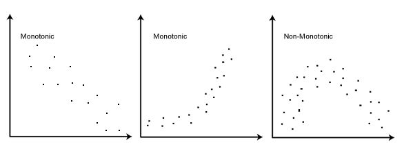

# Every Concept explained

#### Important concepts :thought_balloon: 

##### 7th December 2018

# ANOVA
- Anova is statistical concept used to gather the relationships between multiple groups. 
- It uses F ratio to either accept or reject the hypothesis that all the different groups have same mean and do not vary from each other beyond a certain threshhold.
$$ Fscore = \frac{SSB*1/DOF}{SSW*1/DOF} $$
where, SSB = sum of squares difference between the groups and SSW = sum of squares difference within the group.
- DOF is calculated by checking number of unknown variables - 1 (because we know mean and hence easy to find the last value of the group)

# Forward Selection
- Forward selection is a type of stepwise regression which begins with an empty model and adds in variables one by one. In each forward step, you add the one variable that gives the single best improvement to your model.
- Forward selection typically begins with only an intercept. One tests the various variables that may be relevant, and the ‘best’ variable — where best is determined by some pre-determined criteria– is added to the model.

- As the model continues to improve (per that same criteria) we continue the process, adding in one variable at a time and testing at each step. Once the model no longer improves with adding more variables, the process stops.

- The criterion used to determine which variable goes in when are varied. You could be attempting to find the lowest score under cross validation, the lowest p-value, or any of a number of other tests or measures of accuracy.

- Since stepwise regression tends toward over-fitting, it is usually good to have strict criteria for adding in any variables. (Overfitting happens when we put in more variables than is actually good for the model; it typically shows a very close, neat fit of the data used in regression, but the model will be far off from additional data points and not good for interpolation).

# Spearmans correlation
- Less strict than pearsons correlation. 
- Pearsons only for linear but spearsons check monotonic rlationship b/w two variables.
- need to rank the data before calculating.

# MLE vs MAP
`https://wiseodd.github.io/techblog/2017/01/01/mle-vs-map/`

# Multi-Fidelity
`Why`
- with the onset of complex algorithms and huge datasets, it has become expensive to compute black box evaluation(since they need to run complete training)
- Training exceeds several hours or even days.
`How`
- search for good configurations on smaller subset of data
- learning model distribution to predict early stopping: http://aad.informatik.uni-freiburg.de/papers/15-IJCAI-Extrapolation_of_Learning_Curves.pdf
	- `why`
		-	The bayesian optimization algorithm has been found to work better than human experts but at the cost of more resources. One key reason is human can detect if the model will perform poorly after gew SGD steps and thus terminate it before complete evaluation.
	- `what`
		-  Thus, this method use learning curve models to predict the performanc of model few iterations and if the predicted performance is smaller than the current best, it stops the evaluation.
	- `how`
		- It records the performance of the model at resular intervals $y_1,y_2...y_n$. These points are used to predict the final performance of the model after many intervals. 
		- It uses set of parametric functions(11) combined linearly to give a single model. Each different model i is associated with a weight $w_i$ and additive gaussian noise $N(0,\sigma^2)$
		- 	The values are predicted using Markov Chain Monte Carlo (MCMC) inference. Procedure: keep track of best performance so far(Threshhold). y starts from $-\infinite$ and keep updating after regular intervals. y is the predicted final performance after $e_{max)$. on termination it returns validation error 1-expected accuracy. Else if predicted performance is greater than current best, it keeps on running.
	-`results`
		- on cifar 10 fully connected layer, it inmproves the speed by the factor of 2. using bayesian optimisation, SMAC,TPE. total 52 hyperparameters. $10(NHP)+6(Layers)*7(LHP)=52HP$
- another paper with similar concept but using bayesian neural networks instead of these functions as basis.
- Freeze-thaw Bayesian optimization 
	- Bag of 10 possible hp configs. You run m iterations and project the results. each projections will have parameters like mean, variance. This is used to refit the gaussian process over the performance function. 
	- from this set, based on the result, throw away the least performing m observations and initialise new random configs instead. repeat.
	- `cons` makes assumptions about accuracy curve, gaussian (so does everyone else right)
- `non-stochastic best-arm identification problem` https://arxiv.org/pdf/1502.07943.pdf
	- `what is successive halving algorithm`
		- add the algorithm image
		- it considers the fix size of iterations, and after fixed number of lever pulls it eliminates half of the worst performing ones. 
		- the number of iterations are based on the initial budget and the size of the inital set of hyperparameters.  ($r = \frac{B}{S*log_2(n)}$) 
		- end output is the best performing configuration singleton set of hyperparameters
	- `cons`
		- Major con is the number of configurations vs budget trade off. The user has to decide before hand whether to assign more budget to each configuration or to include many configurations but each with small budget. Assigning small -> premature termination of good configurations and large -> poor configurations running for long time and exploiting resources.
- `Hyperband` - http://www.jmlr.org/papers/volume18/16-558/16-558.pdf
	- `why`
		- number of configuration vs budget trade off. Also, bayesian optimization seems to surpass random search but by a small margin.   
	- `What?`
		- Rather than treating the given HPO problem as configuration selection, it treats it as configuration evaluation problem. 
		- It selects configurations at random and use successive halving algorithm for early stopping of these algorithms that do not show any promise. 
		- It solved the problem of specifying configurations vs budget algorithm by dividing the problem into several combinations of successive halving.
		- Shown to improve over random search and black box bayesian optimisations and takes only a constant time more when compared to vanilla random configuration over deep neural networks.
		- shows strong performance compared to bayesian and highly  parallel and easily scalable to higher dimesnional spaces.
		- doesn't use covariance between HPs and Loss function. 
	 - `cons` It uses random search and thus can be further improved using existing knowledge to select new configurations. Due to this can lead to worse final time approached compared to modelled approaches,There comes BOHB. 
 - BOHB https://arxiv.org/pdf/1807.01774.pdf
	 - use it for writing the introduction too
	 - `why`
		 - Hyperband's con 
	 - `what`
		 - It extends the work of Hyperband by eliminating the need to perform random search while generating new confiurations to evaluate, instead implement a bayesian model to use the collected dataset and predict a distribution over function using configuration data to predict loss. 
		 - It takes a similar approach to TPE but instead of using mulltiple one dimensional KDE arranged hierarchichally, it used a single multidimensional KDE.  To fit this kernel, min of D+1 evaluations are required where D number of hyperparameters.
		 - It enforces explorations by randomly sampling $\rho$ fraction of total configurations instead of using the model.
		 - It outperforms all the state-of-the-art HPO methods for the tasks like SVM classification, NNs and reinforcement learning. 		 -  COCO PLATFORM - provides benchmarks and analysis ools for continous optimization.

# Bayesian optimization

- Bayesian optimization is an iterative algorithm that predicts the distribution of the performance of the learning model with respect to the hyperparamaeters. It is comprised of two major components : a surrogate model and an acquisition function. Using the results obtained from the different evaluations, surrogate model is fitted to a distribution. The acquisition function uses this model to determine the next values of hyperparameters to evaluate. The acquisition function is designed to tradeoff between exploration and exploitation, that is, find an optimal balance between finding the candidate sets from the high certainity regions while exploring unknown regions at the same time. The acquisition functions are cheap to evaluate and thus comparitively easy to optmize. There has been many different models published based on the choice of surrogate models and acquisation functions used, below few of the most prominent ones are explained.
	-  `Guassian process priors`
		- The guassian process provides the strong prior over functions and has been widely used for because of their capabilities to provide smooth and well caliberated uncertainity estimates of the learning model distribution. \ref{https://arxiv.org/pdf/1807.01774.pdf} 
		- Initial prior is assumed to be random as their is no data but this is where expert knowledge can be used by pulggin the prior knowledge of the learning model distribution.
		- A gaussian process prior is described using mean and a covariance function. Mostly, mean is assumed to be constant or centered around 0 and thus the quality of a gaussian process is largely dependent the choice of covariance function.
		- Usual choice of Kernel function is squared exponential kernel. But this choice of kernel give very smooth distributions that are not applicable to many practical problems. Another good choice of covariance function/Kernel is Matern 5/2 kernel. \ref{https://papers.nips.cc/paper/4522-practical-bayesian-optimization-of-machine-learning-algorithms.pdf} 
		- `parallelize` Since our model learn its parameters from results obtained by evaluating different HP points, how do we parallelize bayesian optimization?
			- simple Batch parallelism. But it lose the information gain of the current batch.
			- Markov chain Monte Carlo(MCMC) estimates of the acquisition functions are used to generate samples using already evaluated data and distributions of data under execution. \ref{https://papers.nips.cc/paper/4522-practical-bayesian-optimization-of-machine-learning-algorithms.pdf}
			- `cons` The calculation of covariance function scale cubically with the number of data points, thus it limits the number of configurations that can be evaluated. There has been many approaches to avoid this scaling by using scalable approximate guassian process approximations.
				- Other cons observed is standard kernel do not scale well in higher dimensions. to overcome this many new extensions have been suggested, like, random embeddings, GP on part of configuration space, cylindrical and additive kernels. \ref{https://arxiv.org/pdf/1807.01774.pdf page 9}
	- `Random forests`
		- Random forests are generally used for regression and classification tasks, highly suited for categorical data. \ref{[24] L. Breiman. Random forests. Machine Learning, 45(1):5–32, 2001}
		- They are considered ensemble of regression trees where each leaf contains the learning algorithm performnace values. 
		- the procedure is like: first randomly sample N points from the configuration space/domain values of hyperparameters. Then the model is evaluated for these hyperparameter sampled values. Using these evaluations a random forest is generated and the number of parameters considered before splitting into different nodes is specified by split ratio(default 5/6). other parameter is $n_{min}$ that defines the min number of datapoints required for splitting. RD predictive mean is calculated using individual tree parameters.
		-`pros` high parallelism, very good for high dimensions and categorical hyperparameters when GP doesn't work well. \ref{HPO,12}  
			-	scaling for fitting and predicting variance - O(n logn) and O(log n) compared to GPs O($n^2$) and O($n^3$)
			-	used in AUTOML frameworks, auto-weka, auto-sklearn and ANOVA framework. \ref{HPO,12}{http://proceedings.mlr.press/v32/hutter14-supp.pdf#page=9}
		- 
	- `TPE` 
		- Contrary to Guassian process, where the learning model distribution was modelled using $p(y/x)$, TPE use the evaluations to model $p(x/y)$ and p(y). It replaces the prior distribution with non parametric densitites, that is, l(x) and g(x). \ref{http://papers.nips.cc/paper/4443-algorithms-for-hyper-parameter-optimization.pdf} 
		- l(x) represents the density of the points for which the corresponding model performance was less than $y^*$.
		- g(x) represents the density of the points for which the corresponding model performance was greater than $y^*$.
		- The $y^*$ is chosen to be some quantile of the observed model performance metric. 
		- The observed densitites are used to maximise the expected improvement to find new candidate points. It is dependent on the ratio $\frac{g(X)}{l(X)}$. This means for maximum improv
- wide applicability (DNNs for image classification, speech recognition and neural language modelling) \ref https://ieeexplore.ieee.org/stamp/stamp.jsp?tp=&arnumber=7352306
- 
> Written with [StackEdit](https://stackedit.io/).
<!--stackedit_data:
eyJoaXN0b3J5IjpbMTE4MTkwNzAwNiwtMTIyNDk5NDA5NywtOT
YxMjYzNzgyLDE1NjEzMTMzNDMsMTI2MjI0MzExMSwtMTg3MTEx
OTEyNiwxNzcxNjU5MjQ3LDM4NjEwMzczNywyMDcxMzU2Mjg1LD
ExODM2MDQxODgsMTIxMTA2MDM5OCw1ODM0MjQ4MTMsLTYwNTMy
MDc4MywtMjAwNzM5MTM2LC0xNzQxODQ5ODU4LDU3NzA1MzE5OS
wtOTI2NTU4NzM4LDE0MjQ3Mjg0NzYsMTA0ODIxNTc1OSw0Nzk4
NTE4NjddfQ==
-->